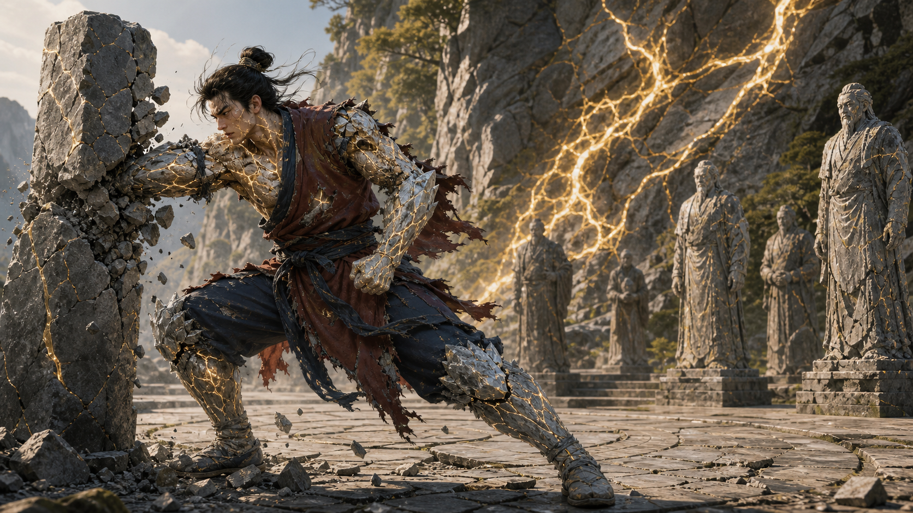

# 流派卡：石胎门

> 生灵入体，山纹炼形。身作灵脉，骨肉为兵。

## 身份

| 项目 | 内容 |
| --- | --- |
| 门派 | 石胎门 |
| 根本功法 | 《山纹炼形法》 |
| 两仪归属 | 阳：生灵 |
| 修行方向 | 生灵 + 炼体 |
| 战斗定位 | 近战、承伤、冲阵、以身破法 |
| 核心意象 | 灵脉、灵石、山纹、石胎、体表灵壳 |
| 功法终局 | 经脉淤塞、关节与体表结晶，最终化为石人 |
| 当前状态 | 门派核心设定已定；玩法数值与四象名称待定 |

## 一句话

石胎门把从灵脉和灵石中临摹得来的生灵纹路刻入修行，以不断产生的灵气冲刷肉身；他们初时进境极快，却无法排出日益堆积的灵气，最终会把自己炼成无法活动的石人。

## 功法原理

**已定：** 石胎门先人观察到，天然灵脉与灵石中的特定纹路会伴随灵气产生。他们不知道其中完整的因果，只知道复现纹路便能复现现象。

《山纹炼形法》将这些纹路转化为人体内的运转路径：

1. 以肉身承载山纹。
2. 沿山纹触发生灵。
3. 让新生灵气反复冲刷血肉、筋骨和皮膜。
4. 无法离体的余灵堆积于身体边界，形成坚固的体表灵层。

他们学会了让这套结构运行，却没有掌握精细导引、离体输出和远程操纵。功法的力量与缺陷来自同一个不完整的发现。

## 修行轨迹

**已定：** 《山纹炼形法》没有真正安全的圆满境界。它从一开始就在把修行者推向石化，只是初期的收益远比代价明显。

1. **初期：** 修行者可以在体内自行生灵，无需等待吐纳或争夺外部资源；新生灵气不断炼体，进境远快于寻常功法。
2. **积灵：** 肉身强度持续提升，未能离体的灵气开始堆积，体表防护越来越坚固。
3. **淤塞：** 灵气产量超过经脉的流转能力，堵塞经脉并妨碍正常运转。
4. **结晶：** 过量灵气在关节和体表形成结晶。修行者更加难以损伤，但动作逐渐迟钝、僵硬。
5. **石人：** 结晶最终蔓延全身。沿未经改造的原本功法继续修炼者，无法避免这个结局。

这不是少数门人的意外走火入魔，而是未经改造的功法结构本身的终点：越接近“不坏”，就越接近不能活动。

## 战斗表现

- 以拳、掌、肩、肘、膝、头槌和冲撞直接作战。
- 身体既是施法载体，也是兵器与护甲。
- 擅长承受正面攻击、突破阵线和破坏脆弱法器。
- 难以使用飞剑、外放术法和精细的灵气操纵。
- 体表灵层只保护肉身，衣物与普通装备在激战中很难保全。

## 认知偏差

**已定：** 石胎门相信自己是在“效法山川，以人身养成石胎”。这种说法足以指导修炼，却没有解释山纹为何能够生灵。

从主角的视角看，《山纹炼形法》更像一段从天然灵脉中逆向抄录的生灵程序：先人成功复制了输出，却没有理解全部输入、边界与接口。

## 与主角的联动

**已定：** 主角本就是机器人，不会因人体结晶而变成石人，但它并没有免除《山纹炼形法》的资源压力。

功法移植到主角后，同一个缺陷会转化为机器问题：

1. 山纹结构持续生成灵气。
2. 程序读取、传输和处理灵气的通量有限。
3. 生灵速度超过通量后，未处理灵气开始积压。
4. 积压占满管线并阻塞信号。
5. 所有传感、控制与行动最终停摆，形成机器版本的“石化”。

玩家不能只增加一条固定管线，因为灵气产量还会继续增长。真正的解法是设计递归且可伸缩的架构，使新的处理单元能够随负载增长而扩展，并能在局部饱和时继续维持关键信号。

**已定：** 在故事后期，主角可以把这套方案反哺石胎门。它为门人建立动态余灵抽取结构，在灵气超过安全通量时将多余部分导出，并压缩制成灵石。

这会同时带来两个结果：

- 经脉和体表不再长期积存过量灵气，石化终局得到解决。
- 《山纹炼形法》持续生成的余灵被转化为能够储存和交易的灵石。

石胎门由此从一个必然走向石化的炼体门派，变成可以持续生灵并生产灵石的门派。主角不是替他们废除祖传功法，而是补上先人从天然灵脉中遗漏的动态输出结构。

## 玩法轮廓

**暂定：** 石胎门流派可以围绕“体表积灵”形成战斗资源：

- 修炼和战斗会持续积累体表灵气，并推进不可逆的结晶程度。
- 积灵提高防御、冲撞能力和徒手伤害。
- 高积灵强化正面战斗，同时降低动作灵活性并加重经脉淤塞。
- 主角介入前，近战招式和卸力动作只能重新分配或暂时缓解积灵，不能消除根本结晶。
- 主角介入后，动态余灵抽取可以在保留炼体效果的同时，把超过安全通量的部分制成灵石。

在动态余灵抽取完成之前，玩家面对的不是“怎样永远避免石化”，而是“为了眼前的胜利，愿意把自己推进到哪一个阶段”。积灵可以管理和延缓，未经改造的功法终局却无法只靠熟练操作消除。

## 弱点与风险

**已定：** 经脉淤塞、关节与体表结晶，以及最终化为石人，是《山纹炼形法》本身不可避免的结果。

**钩子：** 以下具体表现尚未成为正典，可在设计敌人、任务和技能时选择：

- 封住部分山纹可能导致灵气淤积，使优势转化为内伤。
- 针对衣物、行囊、符器和环境的攻击，可以绕开其肉身防御造成战术压力。
- 少数门人试图补全“离体”部分，却可能把稳定的灵壳变成失控外泄。

## 叙事钩子

- 石胎门保存着最早临摹的灵脉石片，其中可能包含被后人误删的纹路。
- 门中把功法视为祖师对山川的体悟，不接受“它是一段可执行结构”的说法。
- 主角补全动态输出结构后，石胎门可能从炼体宗门转变为重要的灵石生产者。
- 某位高手的衣物与随身物从不损毁，暗示他已经秘密掌握灵气离体的方法。
- 门中历代留下的石人究竟是遗骸、仍有意识的祖师，还是维持某种大阵的节点？

## 待定问题

- 石胎门位于灵山、矿区，还是灵脉枯竭后的荒地？
- 他们是正统炼体宗门、边地小派，还是被主流排斥的生灵异端？
- “体表灵层”的本土正式名称是什么？
- 《山纹炼形法》是否会把纹路实际留在皮肤或骨骼上？
- 石胎门如何解释化为石人的终局：功法缺陷、祖师坐化，还是所谓的“不坏正果”？
- 化为石人之后，修行者是否仍然保有意识？
- 动态余灵抽取由门人自行控制、主角持续维护，还是一座宗门级阵法负责？
- 源源不断产出的灵石会如何改变石胎门与整个修仙界的经济？
- 这一流派在未来四象体系中应叫什么？
