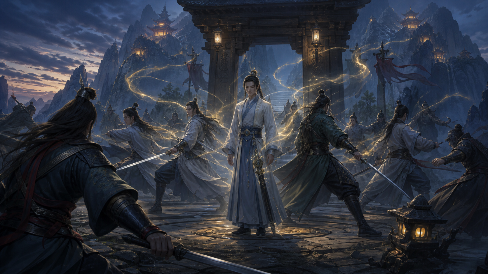

# 流派卡：藏锋宗（暂名）

> 每一天不出手，都在替下一剑增添分量。

## 身份

| 项目 | 内容 |
| --- | --- |
| 宗门 | 藏锋宗（暂名） |
| 根本功法 | 待命名 |
| 两仪归属 | 阴：取灵 |
| 修行方向 | 取灵 + 蓄能 + 剑修 |
| 门内分支 | 外门临阵蓄势；内门终身藏锋 |
| 战斗定位 | 延迟爆发、择机斩杀、战略威慑 |
| 核心挑战 | 伤害预测、目标控制、攻击频率调度 |
| 核心意象 | 未出鞘的剑、漫长等待、一次兑现、隐世长老 |
| 当前状态 | 核心机制、取灵归属与内外门结构已定；正式名称待定 |

## 一句话

藏锋宗的剑修保持蓄能状态越久，下一击就越强；外门在一场战斗中等待出剑时机，内门则可能等待一生，宗门深处甚至传说藏着已经蓄势数万年的长老。

## 功法原理

**已定：** 这门尚未命名的功法以取灵为主。修行者持续从外界吸纳已有灵气，将其保存并集中给下一击；蓄能状态保持越久，能够积累的力量就越多。

它最重要的不是一套复杂剑招，而是两个状态：

1. **蓄势：** 保持克制，不以目标招式出手，持续增加下一击的威力。
2. **兑现：** 在选定时刻出剑，把此前积累的力量集中释放。

蓄势可以发生在战斗中的几个呼吸之间，也可以跨越数年、数代，乃至传闻中的数万年。时间尺度不同，催生了完全不同的门人生活与宗门制度。

**已定：** 一次有效出手会兑现此前的积蓄，随后重新开始蓄能。什么动作算作“出手”，以及落空、被格挡或误击是否同样消耗积蓄，仍需进一步确定。

## 外门：临阵蓄势

**已定：** 外门弟子会在每一次战斗中开始或继续蓄能，并在当场释放。

- 他们把等待压缩到战斗节奏之内。
- 蓄势越久，下一击越危险，但对手也有更多时间行动。
- 外门剑修的核心能力是判断：现在这一剑是否已经足够，还是值得再等一刻。
- 他们接受蓄能经常归零，以换取可以参加日常战斗的实用性。

外门代表的是战术上的藏锋：强大不来自频繁攻击，而来自延迟攻击并选择释放时机。

## 内门：长期藏锋

**已定：** 内门弟子轻易不出手。他们持续蓄能，等待宗门认为真正有必要的时刻。

- 普通争斗不会动用内门。
- 一名内门剑修越久没有出手，他作为威慑的价值就越高。
- 内门的修行成果无法通过切磋证明，因为证明本身就可能浪费多年积蓄。
- 宗门要求他们把个人的胜负、声名和冲动让位于一次尚未到来的出剑。

内门代表的是战略上的藏锋：他们不是日常战力，而是宗门保存至未来的一次性答案。

## 隐藏长老

**已定：** 相传宗门藏有多位已经蓄能数万年的长老，只有灭门大难来临时才会出手。

同样确定的是：

- 没有人知道隐藏长老的数量。
- 没有人知道传闻是否真实。
- 长老长期不现身，与他们必须持续藏锋的说法彼此印证。
- 宗门从这种不可验证性中获得了真实的威慑。

即使隐藏长老并不存在，敌人也必须把他们可能存在的后果计算进去；如果他们确实存在，那么第一次验证很可能也是最后一次。

## 认知偏差

**已定：** 宗门知道自己的主要力量来自长期取灵，也知道“保持蓄能越久，下一击越强”。这符合人类对力量来源的直觉：灵气从外界而来，只是在剑中或体内越积越多。

他们未必真正理解的，是功法为何能把漫长时间里取得的灵气全部绑定到“下一击”，以及天道如何判断一次动作是否构成这次兑现。

从主角的视角看，这门功法像一个持续读取外部资源的缓冲器：平时只写入、不输出，直到某个动作被识别为出剑，才把缓冲内容一次性释放并清零。能源来源并不神秘，值得研究的是保存与触发规则。

## 组织依赖

**已定：** 藏锋门人非常依赖集体。功法让他们拥有远超境界的单次攻击，却没有让他们擅长处理每一个挡在面前的普通敌人。

- 面对境界低于自己的敌人，藏锋门人也可能轻易落败。
- 如果出剑，他们可能把多年积蓄浪费在不重要的目标上。
- 如果坚持不出剑，他们仍会受伤、被擒或被杀。
- 脱离宗门后，很少有人能长期保护自己的蓄势状态。
- 他们必须与其他门派组成组合，由盟友处理低价值目标、牵制敌人并创造值得出剑的时机。

因此，团结对藏锋宗不是抽象美德，而是功法能够成立的前提。外门保护内门，盟友保护藏锋，藏锋则为整个组合保存足以解决最终威胁的一击。

## 与主角的联动

**已定：** 藏锋宗交给玩家的核心难题是控制与预测，而不只是等待蓄势条增长。一次正确的出剑至少需要同时满足两个条件：当前剑势足以击败目标，目标也会在出剑时进入能够命中的位置。

玩家需要持续完成一组彼此依赖的判断：

1. 观察或推断敌人的有效剩余承伤，包括防御、减伤和可能的变化。
2. 估算藏锋当前积蓄的实际伤害，以及继续等待后的增长。
3. 算出最早能够击败目标的出剑时刻，避免伤害不足或过度蓄势。
4. 通过牵制、定身、诱导走位或盟友配合，让目标进入预定的命中窗口。
5. 只有伤害条件与命中条件同时成立时，才触发这次攻击。

主角的机器形态不会替玩家自动解决这些问题。感知可能不完整，敌人可能改变状态，控制也可能失败；程序需要根据战场信息不断更新预测，并在原计划失效时重新调度。

**暂定：** 主角后期可以把机器上验证过的合击调度方法反哺宗门。它将多名门人错开安排为不同的蓄势周期：短蓄势、高频率的一层处理普通敌人；中等蓄势的一层应对强敌；长期蓄势的内门与隐藏长老继续作为战略储备。控制型盟友负责创造命中窗口，调度系统则把每个目标交给代价最低但威力足够的一击。

这套方法不提高单次攻击的力量上限，而是减少过度杀伤、落空和无人可以及时出剑的火力空窗。藏锋宗由此可以从“等待一剑解决一切”，发展成以不同攻击频率覆盖不同战场节奏的协作体系。

## 玩法轮廓

**暂定：** 外门玩法可以围绕一个持续增长的蓄势状态展开：

- 不使用目标剑招时，下一击的强度持续增长。
- 玩家可以移动、防御或使用有限手段拖延，但能够保留蓄势的动作范围需要明确。
- 玩家需要观察敌人的剩余承伤与自身的伤害增长，寻找刚好足以击败目标的蓄势时长。
- 提前出剑可能无法击杀；过晚出剑会浪费积蓄，并可能错过控制与命中窗口。
- 敌人可以通过逼迫走位、制造假目标或诱骗格挡，尝试让玩家错误兑现蓄势。
- 低境界敌人也具有战术价值：他们可以消耗藏锋的保护者，并迫使藏锋把大招浪费在小目标上。
- 藏锋最适合成为队伍中的延迟输出，由其他流派承担清杂、控制、防护和创造窗口；玩家则需要协调这些动作与藏锋的预计出剑时刻。

**暂定：** 内门更适合作为长期世界状态、剧情资源或一次性支援，而不是常规战斗角色。是否请求某位内门出剑，应当是会永久改变宗门力量的决定。

## 制度与冲突

**钩子：** 这门功法会自然产生一套围绕“谁有权决定出剑”的制度：

- 谁能判断一场灾难值得消耗百年或万年的积蓄？
- 内门剑修能否拒绝宗门命令，继续等待他们认定的更大危机？
- 宗门是否故意夸大隐藏长老的数量？
- 一位从未出过剑的长老，如何证明自己不是普通人或早已死去？
- 当真正的大难始终没有到来，终身等待究竟是崇高修行，还是被制度吞没的一生？
- 盟友究竟是在保护藏锋，还是在控制谁有资格调用那一剑？

## 待定问题

- 宗门与根本功法的正式名称是什么？
- 藏锋主要通过吐纳、佩剑、阵地还是其他媒介取灵？
- 什么动作会被功法判定为“下一击”？
- 一击落空或被挡住后，积蓄是否仍会全部消失？
- 蓄能附着于修行者、佩剑，还是二者组成的整体？
- 修行者死亡后，积蓄能否保留或传承？
- 隐藏长老是否真的存在；如果存在，他们如今还是人吗？
